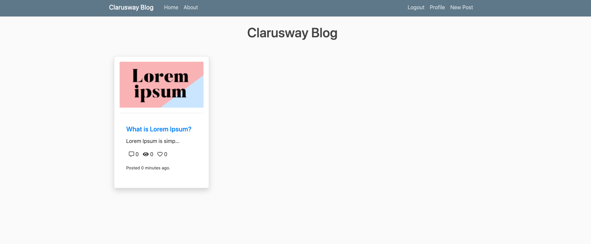

# Project-503: Otomatik Ölçeklendirme, S3, İlişkisel Veritabanı Hizmeti (RDS), VPC Bileşenleri, Lambda, DynamoDB ve Route 53 ile Cloudfront ile AWS Application Load Balancer üzerinde dağıtılan Blog Sayfası Uygulaması (Django)

## Tanım

Clarusway Blog Sayfası Uygulaması, blog uygulamasını AWS Bulut Altyapısı üzerinde Django Framework ile yazılmış bir web uygulaması olarak dağıtmayı amaçlamaktadır. Bu altyapı, tanımlanmış VPC'de Otomatik Ölçeklendirmeli Elastik Bilgi İşlem Bulutu (EC2) Örnekleri Grubuna ve İlişkisel Veritabanı Hizmetine (RDS) sahip Application Load Balancer'a sahiptir. Ayrıca The Cloudfront ve Route 53 servisleri mimarinin önünde yer almakta ve trafiği güvenli bir şekilde yönetmektedir. Kullanıcı kendi blog sayfasına resim ve video yükleyebilir ve bunlar S3 Bucket'te tutulur. Bu mimari Firms DevOps Guy tarafından oluşturulacak.

## Sorun bildirimi


- Şirketiniz yakın zamanda izole VPC ortamında Blog web uygulaması olarak hizmet vermeyi amaçlayan bir projeyi tamamladı. Siz ve meslektaşlarınız proje üzerinde çalışmaya başladınız. Geliştirici ekibiniz uygulamayı geliştirdi ve siz uygulamayı üretim ortamında dağıtacaksınız.

- Uygulama Clarusway Fullstack geliştirme ekibi tarafından kodlanıp DevOps ekibi olarak sizlere verilmektedir. Uygulama, kullanıcıların, kullanıcı kayıt verilerinin AWS RDS hizmetinde ayrı bir MySQL veritabanında tutulması ve resim veya videoların S3 klasöründe tutulması gereken kendi blog sayfalarını yazmalarına olanak tanır. Filmleri ve videoları içeren S3 Bucket'in nesne listesi DynamoDB tablosuna kaydedilir.

- Uygulama "AWS Console" üzerinde hazırlanacak. Çözüm de AWS Console üzerinde olacak. Uygulama için CloudFormation şablonunu hazırlarsanız size ekstra bonus kazandıracaktır.

- Web uygulaması Django çerçevesi kullanılarak dağıtılacaktır.

- Web Uygulamasına web tarayıcısı aracılığıyla güvenli her yerden erişilebilmelidir.

- Programınızı Github'daki proje deposuna göndermeniz rica olunur. Bunu AWS Cloud'daki üretim ortamındaki web sunucularına çekeceksiniz.

Mimaride aşağıdakileri kullanarak altyapınızı yapılandırabilirsiniz,

- Uygulama yığını yeni AWS kaynaklarıyla oluşturulmalıdır.

- VPC'nin özellikleri:

  - VPC'de iki AZ bulunur ve her AZ'nin 1 genel ve 1 özel alt ağı vardır.

  - VPC'de İnternet Ağ Geçidi var

  - Genel alt ağlardan birinde NAT Örneği var.

  - Genel alt ağda Bastion ana bilgisayarı olarak yeni örnek oluşturabilir veya NAT örneğini Bastion ana bilgisayarı olarak kullanabilirsiniz.

  - Özel ve genel rota tabloları yönetilmelidir.

  - Public ve özel alt ağlara dayalı yönlendirme politikaları ve alt ağ ilişkilerine göre yönlendirme tabloları düzenlenmelidir.

- Oluşturulan VPC içerisinde Ubuntu 22.04 EC2 Örneklerinin Otomatik Ölçeklendirme Grubuna sahip Application Load Balancer oluşturmalısınız.

- Oluşturulan VPC üzerinde özel alt ağlardan birinde RDS örneği oluşturmalı ve uygulama üzerinde yapılandırmalısınız.

- Otomatik Ölçeklendirme Grubu, ihtiyaç duyulan bulut sunucularını başlatmak için bir Başlatma Şablonu kullanmalı ve aşağıdaki şekilde yapılandırılmalıdır:

  - oluşturulan VPC'deki tüm Erişilebilirlik Alanlarını kullanın.

  - örneklerin istenen kapasitesini "2" olarak ayarlayın

  - minimum örnek boyutunu "2" olarak ayarlayın

  - örneklerin maksimum boyutunu "4" olarak ayarlayın

  - sağlık kontrolü yetkisiz süresini "90 saniye" olarak ayarlayın

  - durum kontrolü türünü 'ELB' olarak ayarlayın

  - Ölçeklendirme Politikası --> Hedef Takip Politikası

    - Ortalama CPU kullanımı (Hedef Değeri %70 olarak ayarlayın)

    - metriğe dahil edilmeden önce saniyeler boyunca ısınma ---> `200`

    - Örnek durumlarını başlatmak, sonlandırmak, başlatamamak, sonlandıramamak için e-posta adresinize bildirim ayarlayın

- ALB konfigürasyonu;

  - Application Load Balancer, her yerden HTTP (80) ve HTTPS (443) bağlantılarına izin veren bir güvenlik grubu içerisine yerleştirilmelidir.

  - Güvenli bağlantı için sertifika oluşturulmalıdır (HTTPS)

    - Sertifika oluşturmak için AWS Sertifika Yöneticisinden yararlanılabilir.

  - ALB, trafiği HTTP'den HTTPS'ye yönlendirir

  - Hedef kitle
    - Sağlık Kontrolü Protokolü HTTP olacak

- Başlatma Şablonu şu şekilde yapılandırılmalıdır;

  - Geliştirici Notlarına dayanarak EC2 örneğinde Django ortamını hazırlamak,

  - Github deposundan "clarusway_aws_capstone" klasörünü indirin,

  - 'clarusway_aws_capstone' klasöründeki gereksinimler.txt dosyasını kullanarak gereksinimleri yükleyin

  - Django uygulamasını 80 numaralı bağlantı noktasına dağıtın.

  - Başlatma Şablonu yalnızca ALB Güvenlik Grubundan gelen HTTP (80) ve HTTPS (443) bağlantı noktalarına ve herhangi bir yerden SSH (22) bağlantılarına izin verir.

  - EC2 Bulut Sunucularının türü "t2.micro" olarak yapılandırılabilir.

  - Başlatılan bulut sunucusu "Clarusway AWS Bitirme Projesi" olarak etiketlenmelidir

  - Django Uygulamasının S3 ile konuşması gerektiğinden S3 tam erişim rolünün EC2'lere eklenmesi gerekir.

- RDS Veritabanı Örneği için;

  - Bulut sunucusu tipi 'db.t2.micro' olarak yapılandırılabilir

  - Veritabanı motoru '8.0.33' sürümüne sahip 'MySQL' olabilir.

  - RDS uç noktası, geliştirici notlarında açıklanan blog uygulamasının ayarlar dosyasında ele alınmalıdır.

  - RDS alt ayarlarını yönetmek için lütfen "Geliştirici notlarını" dikkatlice okuyun.

  - Bonus!!!!! Veritabanı kullanıcı adı ve şifresi SSM Parameter Store'dan alınacaktır ve bu seçeneği uygularsanız "src/cblog/settings.py" dosyasını SSM parametresine göre değiştirmeniz gerekir.

- Cloudfront, aşağıdaki yapılandırmalarla Uygulama Yük Dengesine işaret eden bir önbellek sunucusu olarak ayarlanmalıdır;

  - Bulut ön dağıtımı ALB ile güvenli bir şekilde iletişim kurmalıdır.

  - Origin Protokol politikası 'Yalnızca HTTPS' olarak seçilebilir.

  - Görüntüleyici Protokol Politikası `HTTP'yi HTTPS'ye Yönlendir` olarak seçilebilir

- Önbellek davranışı olarak;

  - GET, HEAD, OPTIONS, PUT, POST, PATCH, DELETE yöntemlerine izin verilmelidir.

  - Çerezleri İlet Tümü seçilmelidir.

  - Bağlantıların güvenliği için yeni oluşturulan ACM Sertifikası kullanılmalıdır. (Aynı sertifikayı ALB ile de kullanabilirsiniz)

  - Önbellek anahtarı ve kaynak istekleri
    - Eski önbellek ayarlarını kullanın
      Başlıklar: Aşağıdaki başlıkları ekleyin
      Başlık Ekle
      - Kabul etmek
      - Kabul Et-Karakter Seti
      - Dil Kabul Et
      - Kabul-Tarihsaat
      - Kabul-Kodlama
      - Yetki
      - Ev sahibi
      - Menşei
      - Yönlendiren
      - Cloudfront-İletilen-Proto

- Rota 53

  - Bağlantı güvenli olmalıdır (HTTPS).

  - Ana makine adınız web sitesini yayınlamak için kullanılabilir.

  - Uygulama yayınlanırken yük devretme yönlendirme politikası ayarlanmalıdır

    - Birincil bağlantı Cloudformation olacak

    - İkincil bağlantı, başka bir S3 klasörüne yerleştirilen statik bir web sitesi olacaktır. Bu S3 paketinde, S3_static_Website klasöründeki dosyalara verilen "sayfa yapım aşamasında" yazan bir resmin bulunduğu temel statik web sitesi var

    - Healthcheck, Cloudfront'un sağlıklı olup olmadığını kontrol etmelidir.

- S3 Kovası olarak

  - İlk S3 Kovası

    - VPC'yi oluşturduğunuz Bölge içinde oluşturulmalıdır

    - Geliştirme ekibi internet üzerinde S3 ve EC2'ler arasındaki trafiği açığa çıkarmayı tercih etmediği için oluşturulan VPC üzerinde Endpoint ayarlanmalıdır.

    - Geliştirici notlarında açıklanan blog uygulamasının yapılandırma dosyasında S3 Bucket adı ele alınmalıdır.

  - İkinci S3 Kovası

    - Bu Kova, yük devretme senaryosu için kullanılacaktır. "Sayfa yapım aşamasındadır" yazan bir resmin bulunduğu basit bir statik web sitesi var

- S3'ün nesnelerini DynamoDB tablosuna yazmak

  - Lambda Fonksiyonu

    - Lambda işlevi Python 3.8 olacak

    - Python Fonksiyonu github deposunda bulunabilir

    - S3 olayı tetikleyici olarak ayarlandı

    - Lambda'nın S3 ve DynamoDB ile konuşması ve oluşturulan VPC üzerinde çalışması gerektiğinden, S3, DynamoDB tam erişim politikaları ve NetworkAdministrator politikasının eklenmesi gerekir.

    - Lambda işlevini tetiklemek için ilk olarak S3 Paketi'nin "S3 Etkinliği" oluşturulması gerekir

    - Lambda Fonksiyonu zaman aşımı 30 saniyeye ayarlandı

  - DynamoDB Tablosu

    - "id" olan birincil anahtara sahip bir DynamoDB tablosu oluşturun

    - Oluşturulan DynamoDB tablosunun adı Lambda fonksiyonuna yerleştirilmelidir.

- BONUS !!!!!! :

  - SSM Parametre Deposu üzerinden Veritabanı kullanıcı adı ve şifresinin alınması (Not: Bu seçeneği uygularsanız "src/cblog/settings.py" dosyasını SSM parametresine göre değiştirmeniz gerekir.)

  - Öncelikle uygulamayı AWS konsolunda oluşturun. Uygulama için CloudFormation şablonunu hazırlarsanız bu ekstra bir bonus olacaktır.

## Proje İskeleti

```metin
clarusway_blog_proj (klasör)
|
|----Readme.md # Öğrencilere verilir (Proje Tanımı)
|----src (klasör) # Öğrencilere verilir (Django Uygulaması)
|----requirements.txt # Öğrencilere verilir (txt dosyası)
|----lambda_function.py # Öğrencilere verilir (python dosyası)
|----developer_notes.txt # Öğrencilere verilir (txt dosyası)
''''

## Beklenen sonuç



### Proje sonunda aşağıdaki konular ele alınacaktır;

- Bash komut dosyası oluşturma

- AWS EC2 Başlatma Şablonu Yapılandırması

- AWS VPC Yapılandırması
   -VPC
   - Özel ve Genel Alt Ağlar
   - Özel ve Genel Rota Tabloları
   - Rotaları yönetme
   - Alt Ağ İlişkilendirmeleri
   - İnternet Ağ Geçidi
   - NAT Ağ Geçidi
   - Bastion Sunucusu
   - Uç nokta

- AWS EC2 Uygulama Yük Dengeleyici Yapılandırması

- AWS EC2 ALB Hedef Grup Yapılandırması

- AWS EC2 ALB Dinleyici Yapılandırması

- AWS EC2 Otomatik Ölçeklendirme Grubu Yapılandırması

- AWS İlişkisel Veritabanı Hizmeti Yapılandırması

- AWS EC2, RDS, ALB Güvenlik Grupları Yapılandırması

- IAM Rolleri yapılandırması

- S3 yapılandırması

- S3'te statik web sitesi yapılandırması

- DynamoDB Tablo yapılandırması

- Lambda Fonksiyonu yapılandırması

- AWS Certification Manager Yapılandırması ile Sertifika Alın

- AWS Cloudfront Yapılandırması

- Rota 53 Yapılandırması

- Sürüm Kontrol Sistemi için Git ve Github


### Proje sonunda öğrenciler;

- Genel ve özel alt ağlar, rota tabloları ve rotalarının yönetimi, internet Ağ Geçidi, NAT Örneği gibi tüm bileşenlerle VPC ortamını oluşturun.

- Web programlama becerilerini uygulayın, Python Django Çerçevesi içindeki paketleri içe aktarın

- 'MySQL' veritabanına bağlantıyı yapılandırın.

- EC2 Örneğinde Blog web uygulamasını yüklemek ve ayarlamak için başlatma şablonundaki "kullanıcı verileri" bölümünü kullanarak bash komut dosyası yazma becerilerini gösterin.

- S3, Lambda ve DynamoDB tablosunu kullanarak bir Lambda işlevi oluşturun.

- AWS VPC, EC2 Başlatma Şablonları, Application Load Balancer, ALB Target Group, ALB Listener, Auto Scaling Group, S3, RDS, Cloudfront, Route 53 yapılandırma becerilerini gösterin.

- Git komutlarını (Push, pull, commit, add vb.) ve Github'u Sürüm Kontrol Sistemi olarak uygulayın.

## Çözüme Giden Adımlar

- 1. Adım: Özel VPC'yi ve tüm bileşenleri oluşturun

- Adım 2: Güvenlik Grupları Oluşturun (ALB ---> EC2 ---> RDS)

- Adım 3: RDS'yi oluşturun

- Adım 4: İki S3 Kovası oluşturun ve bunlardan birini statik web sitesi olarak ayarlayın.

- Adım 5: Github'daki "Clarusway" deposundan proje tanımını indirin veya kopyalayın

- Adım 6: Github deponuzu hazırlayın

- Adım 7: Başlatma Şablonunda kullanılacak bir kullanıcı verisi hazırlayın

- Adım 8: Clarusway Fullstack Developer ekibi tarafından verilen ayarlar dosyasına RDS, S3 yazın

- Adım 9: Genel Alt Ağda NAT Örneği Oluşturun

- Adım 10: Bunun için Başlatma Şablonu ve IAM rolü oluşturun

- Adım 11: Güvenli bağlantı için sertifika oluşturun

- Adım 12: ALB ve Hedef Grup Oluşturun

- Adım 13: Başlatma Şablonu ile Otomatik Ölçeklendirme Grubu Oluşturun

- Adım 14: ALB'nin önünde Cloudfront oluşturun

- Adım 15: Yük Devretme ayarlarıyla Route 53'ü oluşturun

- Adım 16: DynamoDB Tablosu Oluşturun

- Adım 17-18: Lambda işlevi oluşturun

- Adım 17-18: S3 Etkinliği oluşturun ve bunu Lambda İşlevi için tetikleyici olarak ayarlayın

## Notlar

- RDS veritabanı özel alt ağda bulunmalıdır. yalnızca ALB güvenlik grubuna sahip EC2 makineleri RDS ile konuşabilir.

- RDS özel gruplarda bulunur ve 3306 numaralı bağlantı noktasından yalnızca EC2'ler onunla konuşabilir

- ALB genel bir alt ağda bulunur ve trafiği http'den https'ye yönlendirir

- EC2'ler özel alt ağlarda bulunur ve onlarla yalnızca ALB konuşabilir

## Kaynaklar

- [Python Django Çerçevesi](https://www.djangoproject.com/)

- [Python Django Örneği](https://realpython.com/get-started-with-Django-1/)

- [AWS CLI Komut Referansı](https://docs.aws.amazon.com/cli/latest/index.html)
```
